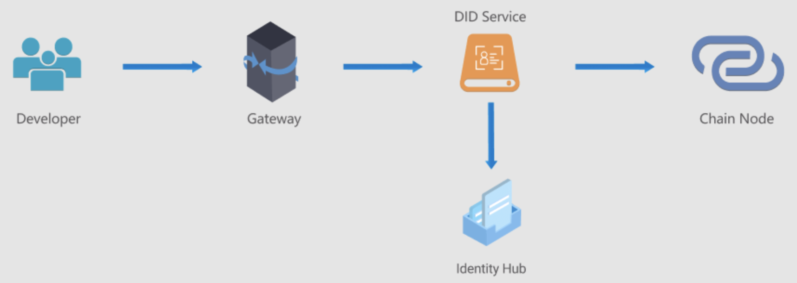

## What is DID?

Decentralized Identifiers refers to a decentralized on-chain mapping of the identity of the real entity, where any individual/organization/entity can create and manage their own digital identities on the blockchain. The traditional identity authentication system has problems such as centralized authentication, identity data security, duplicate authentication, multi-location authentication, etc. With the promotion and application of blockchain technology in various industries, DID will be used more and more widely.

## BSN DID Overview
BSN DID takes blockchain technology as the cornerstone and W3C DID as the specification to provide digital identity and digital credential interaction for individuals/organizations, and the BSN opens DID services to the public through BSN gateway. It consists of three main parts: SDK, Service and Smart Contract. The SDK can be integrated into developers' projects; the Service handles the business logic and connects the Identity Hub and the chain nodes; the smart contract is deployed on the blockchain, and the Service makes contract method calls.

Currently, BSN DID is available for free public test and we welcome everyone to try it and give feedback for improvement. We will continue to optimize and improve the service functions.

## SDK Introduction
BSN currently provides a Java-based SDK, developers can quickly and easily access BSN DID Services through the SDK.

### Access Parameters
- Gateway address

  BSN China: `https://didservice.bsngate.com:18602`

  BSN International: `https://did.bsngate.com:18602`

- Public Test Parameters

  `PROJECTID：8320935187`

  `TOKEN:3wxYHXwAm57grc9JUr2zrPHt9HC`

### Steps to Use

1. Compile and package the source code into a jar file named did-sdk-1.0.jar.

2. Add did-sdk-1.0.jar to the "classpath" directory of the project.

3. Create an instance of DidClient, e.g.:

   `DidClient didClient = new DidClient(URL, PROJECTID, TOKEN);`

4. Call the methods within the SDK, such as:

   `DidDataWrapper didData = didClient.createDid(true);`

### FAQ

#### 1. Why the data in the DID generation process will not be uploaded to the chain?
First of all, the DID generation process is offline, developers can generate their own public and private key pairs based on the Secp256k1 algorithm, and assemble the DID Document by themselves (please read the interface document for details); secondly, some business systems might have this requirement and need to execute some business logic after generating the DID, so that they will only upload the DID Document once it's done. We split the process of generating and uploading DIDs into two parts, and make a distinction by adding parameters for on-chain tags.

#### 2. Does the process of generating and uploading a DID guarantee that the DID Document has been successfully uploaded to the chain?
As long as the response packet is received, it is basically confirmed that the DID Document has been uploaded. The DID Services perform the upload first, and return the response packet only after the upload is successful. If you want to ensure the result, we suggest you to call the Get DID Document method for verification.

#### 3. What does the "Key Update" refer to? Does the update have any effect?
There are two pairs of public and private keys in the process of generating DID - a primary key pair and a recovery key pair. "Key Update" refers to regenerating a pair of primary public and private keys by the recovery public and private key pair, in case of losing or exposing the primary private key.
After updating the primary key pair, the public key in the DID Document on the chain will be updated, and it affects all the previous signatures and the third-party verification. Generally, it only involves the verification of the credential contents issued by the issuer. For issuers, it is more important to keep in mind the public and private key pairs and better not to update the keys.

#### 4. When do I need to register as an issuer?
The issuer is the individual/organization that can issue or distribute digital credentials. Digital credentials here can be understood as documents, for example, the content in a diploma is the credential, and the content in a driver's license can also be a credential. The diploma or driver's license is a physical object in reality, and the DID system digitalizes these physical objects. The deploma is issued by a university and the driver's license is issued by the Traffic Management Bureau, so the university and the Traffic Management Bureau need to register as issuers after creating the DID before issuing digital credentials to users.

#### 5. What are the prerequisites for the issuer to issue credentials?
First of all, the issuer must have the role of issuer; secondly, the issuer must define the credential template; finally, the issuer must provide the user with a client to apply for the credential. The user is asked to fill in the required attribute values in the credential template defined by the issuer in the client, and then the issuer can issue and present the credential to the user.

#### 6. Where are the credential templates and credentials stored?
The credential template belongs to the issuer and needs to be public and transparent, so the issuer defines the credential template and stores it on the chain; the credential is generated based on the credential template and belongs to the user individually, so it cannot be stored on the chain. There are two ways to store it:

1) After issuing the credential, the issuer directly returns the digital credential to the user and the user keeps it by himself.

2) The credential is stored in the Identity Hub provided by the BSN. Each credential of each user can be stored in the Identity Hub (hereinafter referred to as Hub) with full access control by the user, and the content of the credential is encrypted so that only the user can parse the plaintext with his private key.
   There are two ways to store credentials in the Hub: the user gets the credentials and registers on the Hub, and then calls the saveResource method to complete the storage; the issuer stores the credentials on behalf of the user, which requires the user to authorize access permissions to the issuer first, and the issuer can register on the Hub in advance to get its own ID in the Hub and present it to the user in the client. In this way, the user can create access permissions for the issuer, and the client provides markers to identify that the user needs to store the credentials in the Hub after the issuer has issued them, then the issuer can directly call the saveResource method after issuing the credentials to complete the storage action on behalf of the user.

      
        
